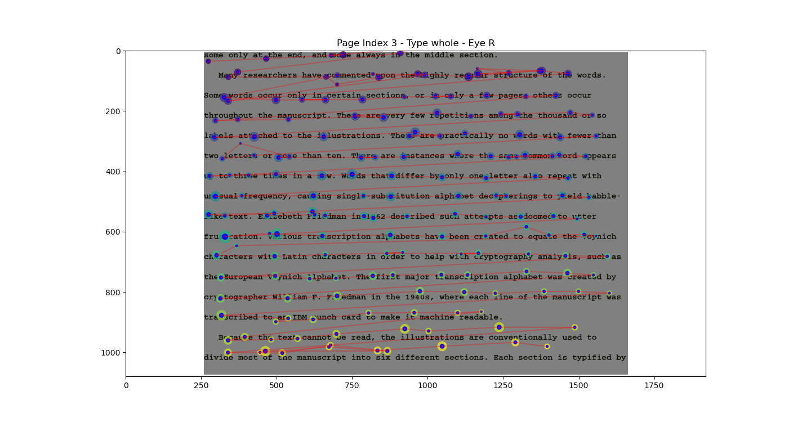
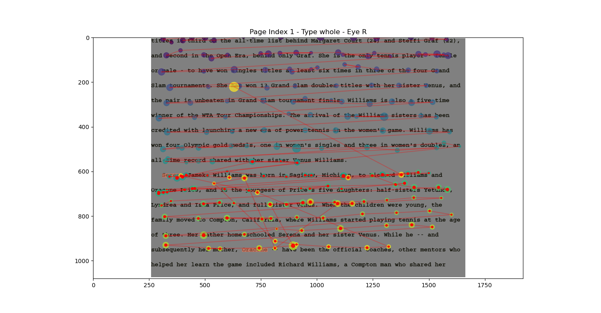

# EyelinkAnalysis
 
This is a replicated repository of my current project **MindlessReading**, which is not public yet. In this project, we leverage EEG and eye-tracking data to study mind-wandering during reading.

I am primarily working on the original repository but will keep this replicated version updated to showcase my coding skills.

## Reading Examples
1. **Normal Reading**
   
2. **Mindless Reading**
   
